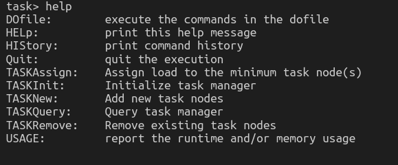

# 2018 DSnP Homework

2018 Fall, Data Structure and Programming  

For test cases, please refer to [DSnP Test Cases](https://github.com/Mckinsey666/dsnp_test_cases) by Brian Chao

## HW1 JSON File Parser

*** You need to hand in HW1 to get authorization code (授權碼)***  

Problem 1:
  Preapare for coding environment.


Problem 2:
  A JSON file parser.

* Features
    * Read
    * Print
    * Add
    * Sum
    * Ave
    * Max
    * Min

## HW2 Command Line Parser

A simple command line interface.  


## HW3 JSON File Database System 

A JSON database system with command line interface.  


## HW4 Memory Manager

A program to practice memory management techniques.  


## HW5 Abstract Data Type

Learning how to implement various abstract data types(ADTs) for sortinginput data.  

* Implement 3 abstract data types
  * Doubly Linked List 
  * Dynamic Array
  * Binary Search Tree
* Additional features
  * Doubly Linked List  
    * Using quick sort for better sorting performance
  * Binary Search Tree
    * Using dummy node 


## HW6 Circuit graph

Parsing a circuit from a AIG description file (`.aag` file) 


- Build the circuit netlist as a graph.
- Print a gate
- Perform DFS from fanin or fanout
- Write back gates in DFS order to the `.aag` file 

## HW7 Heap and hash

Implement a task manager using min-heap and hash table.



## Final Project : Fraig

Functionally Reduced And-Inverter Graph (FRAIG)  


**WARNING**: CirSim and CirFraig remains unfinished yet, use with care!

### Useful tools (but NO WARRANTY)
`genTR.sh` : Automatically run Fraig and reference program with provided dofile.
If `[run diff]` is assigned, `diff` the result.

The script will create `td/` folder to store results if the folder doesn't exists.

```bash
$ ./genTR.sh <dofile filename> [run diff]
$ ./genTR.sh dosim5 1 // run diff after dofile
$ ./genTR.sh dosim5   // only run dofile
```
`packFraig.sh` : Package fraig project into the acceptable format and run `SelfCheck` for handing-in this homework.

```bash
$ ./packFraig.sh <student number>
$ ./packFraig.sh b066602037 // will generate b066602037_fraig.tgz
```

### Simulation
Input file example (sim10):
```
011100010001011110100111110011110111
100001101000000101110011110101110001
100011011010100111000111011110111111
010010001010111100101000100011100100
```
The number of input bit-pattern must be eqivalent to correspond fanin(s).
1. Perform simulation every 64 bits (sizof `size_t`), that is, every 64 lines.
2. Construct FEC groups.
3. Write simulation results to output file.

Output file format:
```
|--------------Input---------------| |-----Output-----|
011100010001011110100111110011110111 1
100001101000000101110011110101110001 1
100011011010100111000111011110111111 1
010010001010111100101000100011100100 1
110111001000111011101100101000110011 1
...
100001010110101110100000101000111111 1
100011010010000101010111111011000011 1
```

How to convert input/output bit-pattern string back to file?
- Input pattern is the same to input file.
- The number of output patterns is eqivalent to fanout(s).

### Construct FEC groups
1. At first simulation, create a FEC groups, add all gates into the group.
2. Divide FEC groups into smaller FEC groups by check if one gate has different sim value.

Use hash table (`unordered_map`) to store FEC groups, take sim value as key, `IdList` as value.  

Initialize:
```
hash map
  ┌──
  │  Group1 (simval 1) ├─ g1, g2 ... g10, g11 ...
  └──
```

For each FEC group, sim the gates in the group.  
Once get different sim value, create a new list and put the gate.  

After divide:
```
hash map
  ┌──
  │  Group 1 (simval 1) ├─ g1, g2 ..
  │  Group 2 (simval 2) ├─ g10, g20 ...
  │  Group 3 (simval 3) ├─ g6, g9 ...
	└── 
```

Repeat until no more FEC groups to divide.  